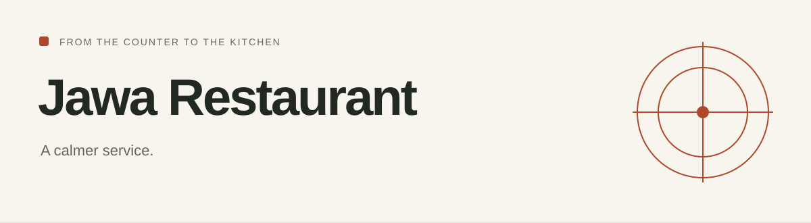
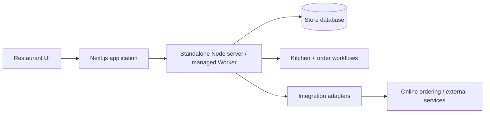

# Jawa Restaurant

<!-- repo-badges:start -->
<div align="center">

[](https://github.com/honeyamn10-source/pos/stargazers)
[](https://github.com/honeyamn10-source/pos/forks)
[](https://github.com/honeyamn10-source/pos/issues)
[](https://github.com/honeyamn10-source/pos/commits/main)
[](https://github.com/honeyamn10-source/pos/blob/main/LICENSE)

[Repository](https://github.com/honeyamn10-source/pos) · [Issues](https://github.com/honeyamn10-source/pos/issues) · [Pull Requests](https://github.com/honeyamn10-source/pos/pulls) · [Actions](https://github.com/honeyamn10-source/pos/actions)

</div>
<!-- repo-badges:end -->

<!-- professional-meta:start -->
<div align="center">

[](https://github.com/honeyamn10-source/pos/actions/workflows/ci.yml) [](https://github.com/honeyamn10-source/pos/actions/workflows/codeql.yml) [](https://github.com/honeyamn10-source/pos/actions/workflows/server-kits.yml)

   

[Documentation](docs) · [Integrations](integrations) · [Contributing](CONTRIBUTING.md) · [Security](SECURITY.md) · [Changelog](CHANGELOG.md)

</div>
<!-- professional-meta:end -->


A self-hosted restaurant register for cash sales, table checks, kitchen batches, pickup requests and daily store operations.

[Project website](https://honeyamn10-source.github.io/pos/) · [Source](https://github.com/honeyamn10-source/pos) · [Build results](https://github.com/honeyamn10-source/pos/actions) · [Issues](https://github.com/honeyamn10-source/pos/issues)

<!-- architecture-showcase:start -->
## Architecture



The repository supports separate deployment paths; external payment, phone and printer integrations require their own live configuration and validation.
<!-- architecture-showcase:end -->

## What it does

- **Take the order.** Build takeaway or table checks with quantities and preparation notes.
- **Keep the kitchen aligned.** Track new, preparing, ready and served batches without restarting earlier items.
- **Close the day.** Reconcile cash shifts, inspect reports and back up the store.

## Start from source

Node.js 24 or later. Open http://localhost:8787 and use the local setup token to create the owner account.

```bash
git clone https://github.com/honeyamn10-source/pos.git
cd pos
corepack enable
corepack prepare pnpm@11.19.0 --activate
pnpm install --frozen-lockfile
pnpm run build:server
pnpm run start:server
```

The standalone Node server and the managed Worker build are separate deployment paths. The commands above select the standalone server. Follow [SERVER_INSTALL.md](docs/SERVER_INSTALL.md) for setup tokens, staff roles, backups and domain configuration. This repository includes both restaurant and retail routes; use `/restaurant` for this edition.

## Check your changes

```bash
pnpm lint
pnpm typecheck
pnpm test
pnpm run test:server
```

These are the repository’s checks, not a claim of complete test coverage. See [GitHub Actions](https://github.com/honeyamn10-source/pos/actions) for the result on a specific commit.

## Scope and limitations

Development/training release. Card payments, live phone service and physical printers require separate integrations and validation. Stock tracks sellable portions, not recipes.

## Find your way around

| Source | Purpose |
| --- | --- |
| [`docs/SERVER_INSTALL.md`](docs/SERVER_INSTALL.md) | Install the server |
| [`docs/START_HERE.md`](docs/START_HERE.md) | Operator guide |
| [`docs/COMMERCIAL_LAUNCH_CHECKLIST.md`](docs/COMMERCIAL_LAUNCH_CHECKLIST.md) | Launch checklist |

## Contributing

Include the command you ran, your runtime version, a minimal reproduction and the expected result in an issue. Remove credentials and personal data from logs. Follow [CONTRIBUTING.md](CONTRIBUTING.md) when proposing a change.

## License

MIT — see [LICENSE](LICENSE). Third-party dependencies retain their own licenses.
