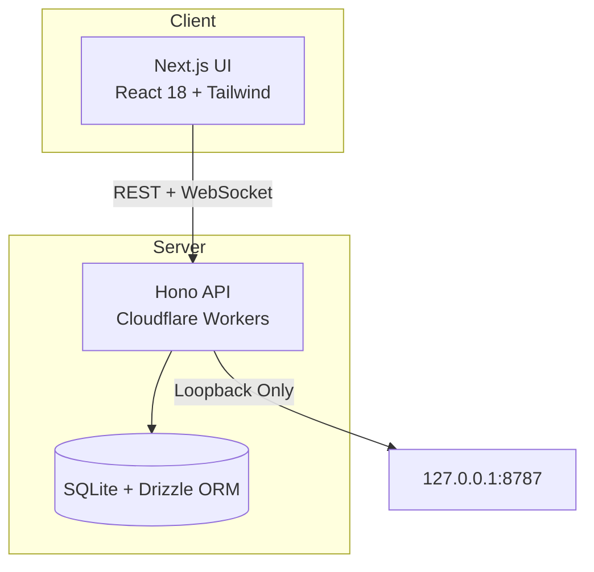

<!-- pos | Bittu Sharma | ultra-level professional README -->
<p align="center">
  
</p>


<p align="center">
</p>


<p align="center">
  <strong style="font-size:3rem;color:#0EA5E9;">pos</strong>
</p>
<p align="center">
  <em style="font-size:1.2rem;color:#94A3B8;">Self-hosted restaurant register — tables, kitchen workflows, inventory, online pickup</em>
</p>
<p align="center">
  
  
  
  
  
  
  
  
</p>

---

## Why this exists

A self-hosted restaurant register that runs on your own server — no cloud
subscription, no forced login, no merchant database on a third-party server.
Orders, receipts, inventory, and backups persist on a server you control.

> **Status: installable controlled pilot, not a completed commercial POS.**
> Cash sales/returns, inventory, tables, kitchen workflows, online pickup
> requests, staff permissions, and encrypted backup/recovery work in tested
> scenarios. Live card payments, native DoorDash/Uber/Skip connections, physical
> printer acceptance, and real phone-call activation remain unfinished or
> unverified. Bounded store supports ≤1,000 orders; long-term storage is a
> release gate.

---

## Quick Start

```bash
pnpm install --frozen-lockfile
pnpm run build:server
pnpm run start:server
```

Open [http://localhost:8787](http://localhost:8787). Use `data/setup-token` to
create your owner account — no default password. Data persists on your server.

---

## Features

- 💵 **Cash sales & returns** with SQLite transaction journal
- 🍽️ **Tables & kitchen workflow** for dine-in service
- 📦 **Inventory** with automatic stock updates
- 🛵 **Online pickup requests**
- 👥 **Staff action permissions** with per-role controls
- 🔍 **Owner-only searchable order history**
- 📊 **Custom business-date CSV reports**
- 💾 **Encrypted backup & recovery** including the journal

---

## Architecture



---

## Security

- Owner account via secure setup token — no default passwords
- Sessions and staff permissions enforced server-side
- Loopback-only serving (`127.0.0.1`)
- No secrets or private hosting identifiers in repo

---

## License

MIT © 2026 Bittu Sharma
